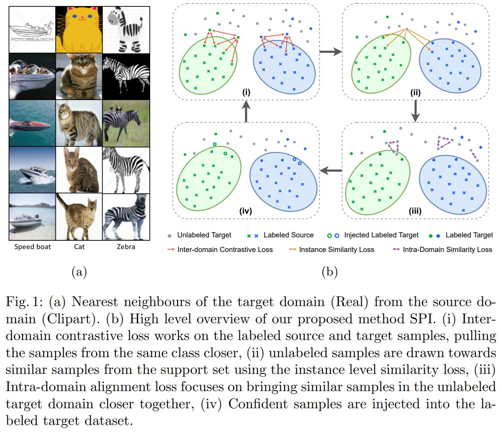
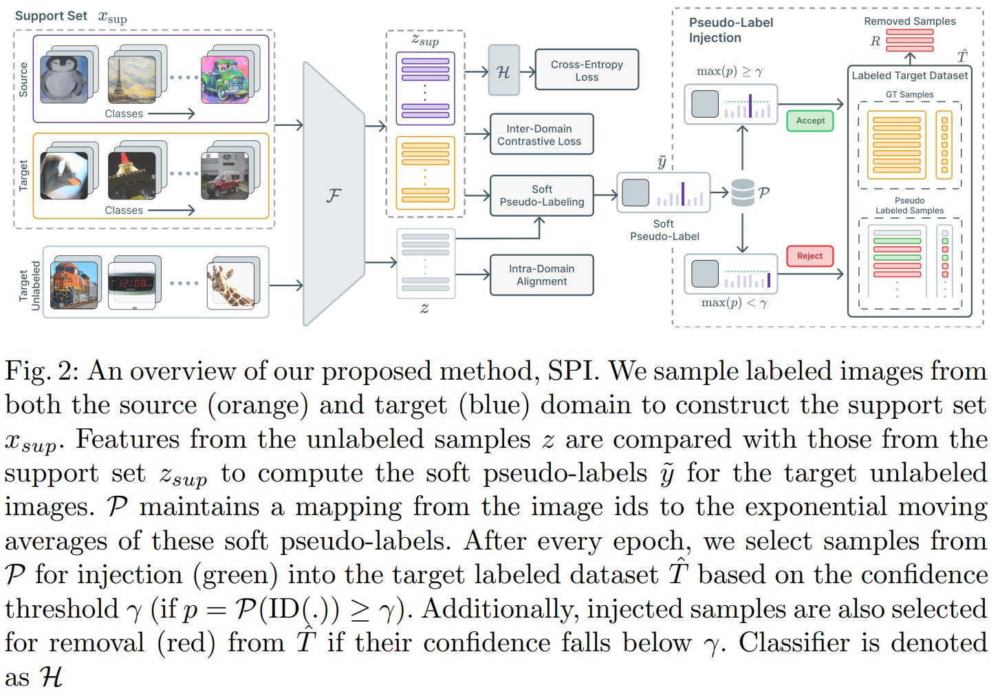

# SPI
Semi-Supervised Domain Adaptation by Similarity based Pseudo-label Injection

## Abstract

*One of the primary challenges in Semi-supervised Domain
Adaptation (SSDA) is the skewed ratio between the number of labeled
source and target samples, causing the model to be biased towards the
source domain. Recent works in SSDA show that aligning only the labeled
target samples with the source samples potentially leads to incomplete
domain alignment of the target domain to the source domain. In our approach, to align the two domains, we leverage contrastive losses to learn
a semantically meaningful and a domain agnostic feature space using the
supervised samples from both domains. To mitigate challenges caused by
the skewed label ratio, we pseudo-label the unlabeled target samples by
comparing their feature representation to those of the labeled samples
from both the source and target domains. Furthermore, to increase the
support of the target domain, these potentially noisy pseudo-labels are
gradually injected into the labeled target dataset over the course of training. Specifically, we use a temperature scaled cosine similarity measure
to assign a soft pseudo-label to the unlabeled target samples. Additionally, we compute an exponential moving average of the soft pseudo-labels
for each unlabeled sample. These pseudo-labels are progressively injected
(or removed) into the (from) the labeled target dataset based on a confidence threshold to supplement the alignment of the source and target
distributions. Finally, we use a supervised contrastive loss on the labeled
and pseudo-labeled datasets to align the source and target distributions.
Using our proposed approach, we showcase state-of-the-art performance
on SSDA benchmarks - Office-Home, DomainNet and Office-31.*

## Architecture

## Model Checkpoints

The model checkpoints trained with our proposed approach can be found [here](https://iiitaphyd-my.sharepoint.com/:f:/g/personal/abhay_rawat_research_iiit_ac_in/Ehm320UHwf5Dmxy_jjwQZW4BDSuuBb1o4hn2-gwLLZHQrQ?e=qzAO7K) 

## Setting up!

The inference code *is coming up soon* to test the performance of our proposed method in different domain adaptation scenarios as mentioned in the paper.

**This section will be updated soon!**

